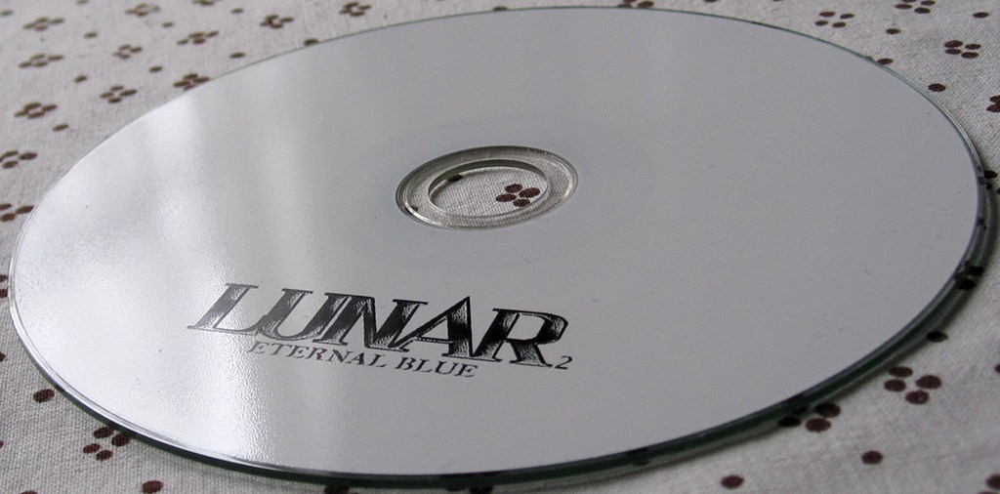

CDThermalCW
===========

CDThermalCW is a Linux driver for the Casio CW-75 thermal CD printer.

Not affiliated with Casio in any way. RE'd for interoperability purposes,
as is legal in the EU, don't look if it would taint you.

Requires libusb-1.0. Takes a PNG as an input, preferably two-color black-white or
grayscale so it looks like what you'll get. 128 pixels high and up to 592 wide.

What
----

With LightScribe dead, and inkjet prints pretty but smudging easily, thermal
printing is the top way to generate pretty coaster tops, for people who still
use such ancient tech. The prints are durable and high quality, and cost-effective
vs inkjet too.

Industrial thermal printers go for a grand or three. They can print the full
area, in multiple colors and shades, for about 4 cents per print. Luckily for
home users, Casio had made a line of them with more palatable entry costs.
From about 2003 onwards, 50-150$ new, capable of printing in a rectangular
area, in one color, monochrome (1-bit). Consumables cost about 17 cents per
full-sized rect area print.

With official drivers only for Windows, and a third-party Japanese dev selling
a Mac driver made with NDA docs (since made freeware), there was no way to use
these on Linux. Seemingly little interest too, couldn't find any google hits
about them & Linux, or RE info about them.

What about the other devices?
-----------------------------

I only have a CW-75. If another model is detected, the code will exit.

The product line is split in two resolutions (200 and 400 dpi), CW-75 is one of the
200 dpi ones. If your model is also 200 dpi, it might work with just removing
the check. No guarantees.

Some of the printers can natively rotate the disc, to print in several areas
without the user having to manually rotate. CW-75 does not have that capability,
so neither does the code.

If you'd like support for the other devices, patches welcome, or donate such hw.
